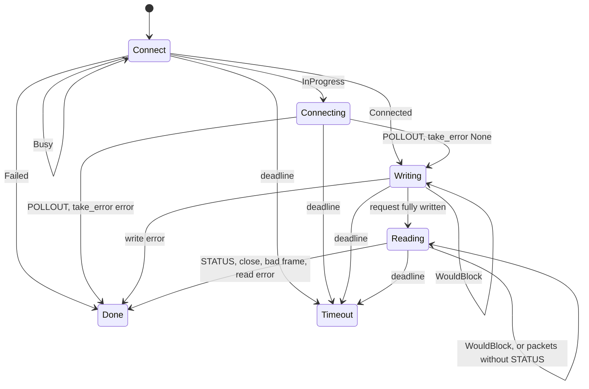

# Registry reads — Specification

This document specifies how pty-core probes session sockets during a listing and how it reads STATUS from many sessions at once, both on the calling thread. It builds on [requirements.md](./requirements.md).

## Status

Active. Implemented in pty-core. The rationale and the measured alternatives are in [decision 0014](../../decisions/0014-registry-reads-run-on-the-callers-thread.md); this specification states the mechanism.

## Scope

Defined here: the non-blocking connect and its outcomes, the poll(2) loop shared by the probe and the batch, the probe's result map, the batch's per-session state machine and error mapping, platform differences, and edge cases.

Not defined here: which sessions a listing probes and how it classifies them (`crates/pty-core/src/registry/list.rs`, [docs/parity.md](../../parity.md) section 5.2), the STATUS packet format (`crates/pty-core/src/protocol`), the `StatsResult` schema, and the single STATUS read (`query_stats_in_with_timeout`), which the batch is held equal to (`PTY.REG-R08`).

## Shape

```
caller thread
  │
  ├─ list_sessions_with ──► probe_sockets_within_budget(paths, budget) ──┐
  │                                                                      ├─► unix_connect::connect  (per socket, per round)
  └─ query_stats_batch_in(root, names, deadline) ────────────────────────┘   unix_connect::poll_until (one poll(2) per round)
```

Both entry points compute one absolute deadline at entry (`now + budget`) and run rounds until every socket has an outcome or the deadline passes (`PTY.REG-R04`, `PTY.REG-R06`). No thread is spawned (`PTY.REG-R01`). Every socket is owned by a local of the call and is closed when the call returns (`PTY.REG-R02`).

## Non-blocking connect

`unix_connect::connect(path)` opens an AF_UNIX stream socket that is non-blocking and close-on-exec, then issues one `connect(2)`.

| Outcome | Cause | Caller's next step |
| --- | --- | --- |
| `Connected(stream)` | `connect` returned 0 | Probe: reachable. Batch: write the request. |
| `InProgress(stream)` | `EINPROGRESS` | Poll `POLLOUT`; any `revents` means done. `take_error()` gives `None` (connected) or the connect error. |
| `Busy` | `EAGAIN` (full accept queue, Linux) or `EINTR` | Drop the socket; retry with a fresh socket next round. |
| `Failed(err)` | any other errno, or an address or socket error | Final. `err` is what a blocking `UnixStream::connect` returns. |

Socket setup:

- Linux: `socket(AF_UNIX, SOCK_STREAM | SOCK_NONBLOCK | SOCK_CLOEXEC)`.
- Other Unix: `socket(AF_UNIX, SOCK_STREAM)`, then `FD_CLOEXEC` and `O_NONBLOCK` through `fcntl`. Apple targets set `SO_NOSIGPIPE`, as std does for every socket.
- The address is built as std builds it and fails with std's texts: an interior NUL gives `InvalidInput` "paths must not contain interior null bytes", and a path of `sun_path` length or more gives `InvalidInput` "path must be shorter than SUN_LEN".
- `EINTR` from `connect` is mapped to `Busy` because an interrupted connect leaves the socket in an unspecified state. A fresh socket is simpler than resuming it.

## Poll loop

Each round:

1. Every socket still without a connection attempt, or marked `Busy`, gets a new `connect`. Outcomes that are final are recorded.
2. Every socket that is waiting on I/O goes into one `pollfd` array: `POLLOUT` while connecting or writing, `POLLIN` while reading.
3. If the array is empty and no socket is `Busy`, the call returns.
4. `poll_until(fds, deadline, retrying)` waits for the remaining time to the deadline, capped at `RETRY_TICK` (10 ms) when any socket is `Busy` (`PTY.REG-C02`, `PTY.REG-T01`). The timeout is rounded up to whole milliseconds, so a sub-millisecond remainder never becomes a busy spin.
5. Each socket with non-zero `revents` advances one step. Sockets with zero `revents` wait for the next round.

`poll_until` returns false, and the call stops, when the deadline has passed or `poll(2)` fails with anything but `EINTR`. On `EINTR` it clears every `revents`, because they are unspecified after a failed poll, and the loop runs another round. Sockets without an outcome when the loop stops count as unanswered.

## Probe

`probe_sockets_within_budget(paths, budget) -> HashMap<PathBuf, bool>`

| Socket's outcome | Map entry |
| --- | --- |
| `Connected`, or `InProgress` then `take_error() == Ok(None)` | `true` |
| `Failed`, or `InProgress` then an error | `false` |
| `Busy` or `InProgress` at the deadline | absent (`PTY.REG-R05`) |

The listing reads `false` and absent the same way: unreachable. Present entries match a blocking connect (`PTY.REG-R07`). A probe never writes to or reads from the socket; a connected probe socket is closed at once. `socket_reachable(path)` is the probe with one path and `SOCKET_PROBE_TIMEOUT` (500 ms), and an absent entry is `false`.

## Batch STATUS

`query_stats_batch_in(root, names: &[String], deadline: Duration) -> Vec<(String, Result<StatsResult, ClientError>)>`

Each name `n` maps to `root/<n>.sock`. The request bytes are `encode_status()`, encoded once and shared by every session. One 8 KiB read buffer is shared by every session.



A write that the socket accepts in full moves on to reading in the same step. A readable socket is drained until `WouldBlock` or an outcome. Packets that are not STATUS are consumed and ignored, as in the single read. `EINTR` from a write or read is retried in place.

### Error mapping

Every row equals what the single read returns for the same event (`PTY.REG-R08`). `map_io_error` uses `GoneSet::Strict`: `ENOENT` and `ECONNREFUSED` count as gone.

| Event | Result |
| --- | --- |
| STATUS packet, JSON parses | `Ok(StatsResult)` |
| STATUS packet, JSON does not parse | `InvalidStats(name)` |
| Connect fails with `ENOENT` or `ECONNREFUSED` | `NotReachable { name, remote: false }` |
| Connect fails with another error | `Connection("connect <ERRNO> <path>")` |
| Write fails, or writes 0 bytes (`WriteZero`) | `map_io_error(…, "write", Some(path), …)` |
| Peer closes before STATUS | `StatsTimeout(name)` |
| Malformed frame | `pty client: dropping connection — <err>` on stderr, then `StatsTimeout(name)` |
| Read fails | `map_io_error(…, "read", None, …)` |
| Deadline passes first | `StatsTimeout(name)` |

The one intended difference (`PTY.REG-T02`): the single read issues a blocking connect before its timeout starts, so on Linux it waits on a full accept queue. The batch retries that connect until its deadline and reports `StatsTimeout`.

## Platform behaviour

| Listener state | Linux | macOS |
| --- | --- | --- |
| Accepting | `Connected`: AF_UNIX connects complete synchronously | `Connected`; an `InProgress` is polled to its outcome |
| Stale socket file, no listener | `Failed(ECONNREFUSED)` | `Failed(ECONNREFUSED)` |
| No socket file | `Failed(ENOENT)` | `Failed(ENOENT)` |
| Full accept queue (`PTY.REG-C01`) | `Busy`, retried until the deadline; probe: absent; batch: `StatsTimeout` | `Failed(ECONNREFUSED)`; probe: `false`; batch: `NotReachable` |
| Accepts, never answers | batch: `StatsTimeout` at the deadline | same |

## Edge cases

- **Empty input.** The probe returns an empty map, and the batch returns an empty list, without opening a socket.
- **Zero budget or deadline.** The first round of connects runs before the deadline is checked. Sockets whose first connect is final therefore appear in the probe map (`true` or `false`), and a batch reports their connect failures as mapped above. Everything else is absent from the probe, or a `StatsTimeout` in the batch. On Linux, where AF_UNIX connects complete synchronously, a zero-budget probe answers every socket except one with a full accept queue.
- **Duplicate paths or names.** The probe map holds one entry per path. The batch returns one entry per requested name, duplicates included, each from its own connection.
- **poll(2) failure other than `EINTR`.** The call stops early, and every socket without an outcome is treated as at the deadline.

## Module map

| Concern | Source |
| --- | --- |
| Non-blocking connect, poll step, retry tick | `crates/pty-core/src/unix_connect.rs` (crate-private) — `Connect`, `connect`, `poll_until`, `RETRY_TICK` |
| Probe | `crates/pty-core/src/registry/list.rs` — `probe_sockets_within_budget`, `socket_reachable`, `DEFAULT_SOCKET_PROBE_BUDGET`, `SOCKET_PROBE_TIMEOUT` |
| Batch STATUS | `crates/pty-core/src/client/stats.rs` — `query_stats_batch_in`, `Step`, `begin`, `write_request`, `read_response` |
| Single STATUS read | `crates/pty-core/src/client/stats.rs` — `query_stats_in_with_timeout`, `query_status_json_at` |
| Error mapping | `crates/pty-core/src/client/mod.rs` — `map_io_error`, `is_gone`, `GoneSet`, `node_error_message` |

## Traceability

| Requirement | Evidence |
| --- | --- |
| `PTY.REG-R01`, `PTY.REG-R02` | By construction: the module map above contains no thread spawn, and every socket is a local of the call. |
| `PTY.REG-R03` | Measured, not tested: [decision 0014](../../decisions/0014-registry-reads-run-on-the-callers-thread.md). |
| `PTY.REG-R04`, `PTY.REG-R05`, `PTY.REG-R07` | `crates/pty-core/tests/observation_roots.rs::socket_probe_matches_a_blocking_connect` |
| `PTY.REG-R06`, `PTY.REG-R08` | `crates/pty-core/tests/observation_roots.rs::batch_stats_bound_every_session_by_one_deadline` |
